# HW3

1 задание

3)
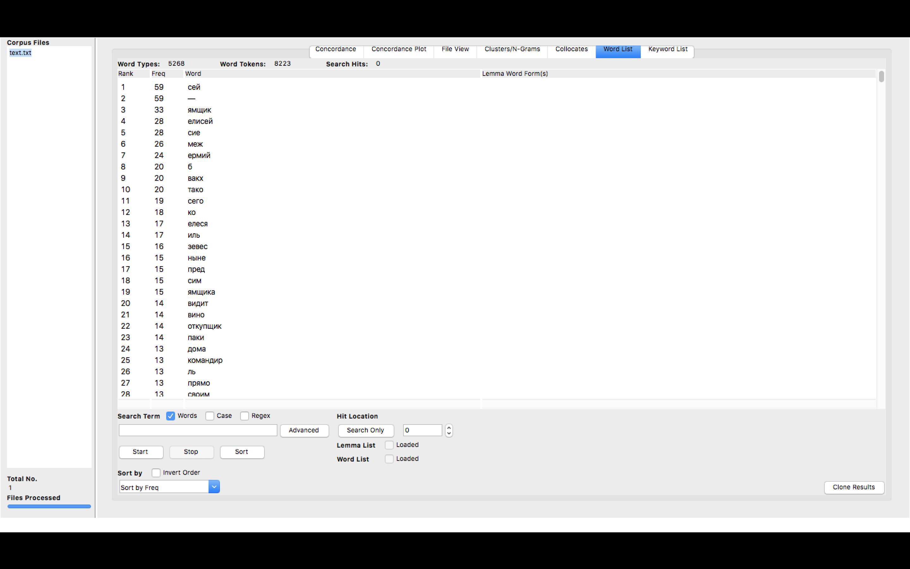

4)
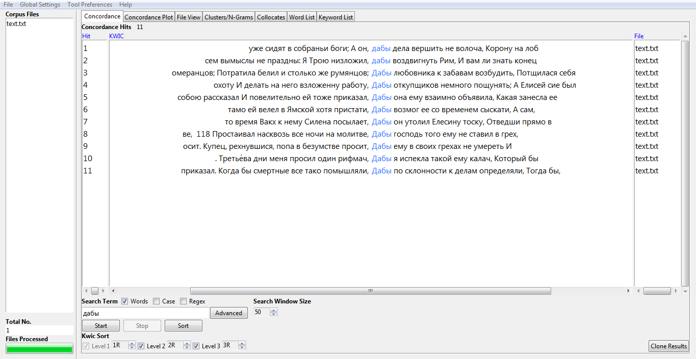
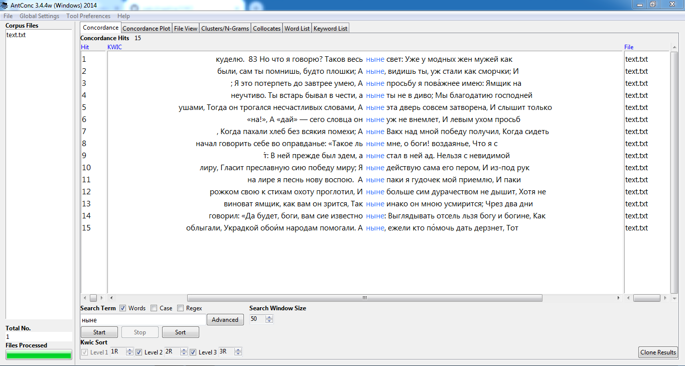
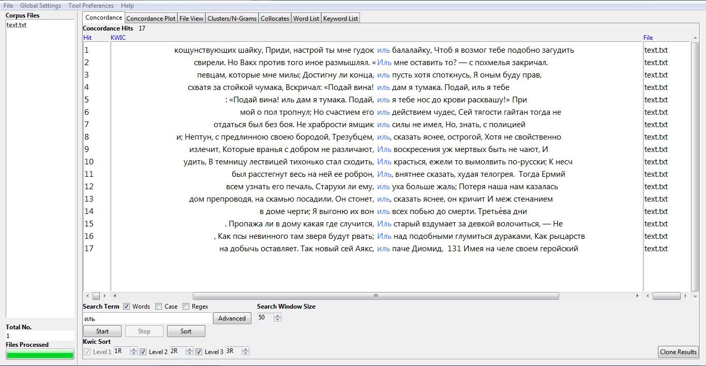

5)
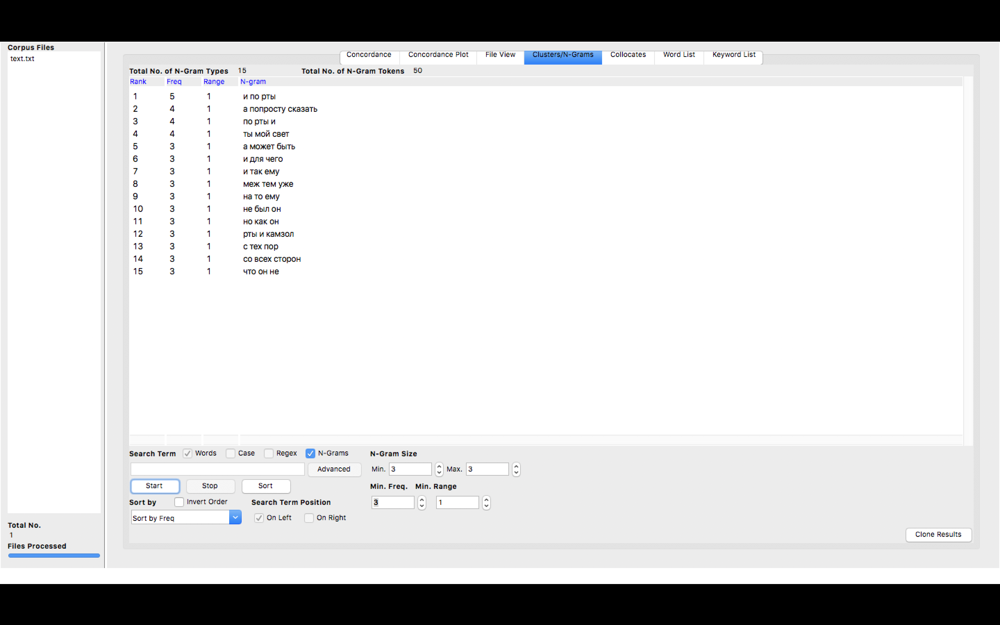
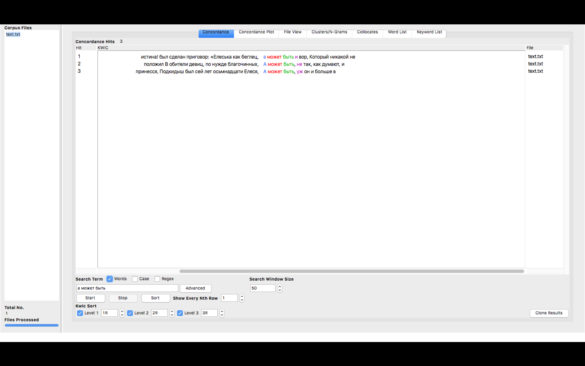

6)

2 задание

2)
СЕЯ
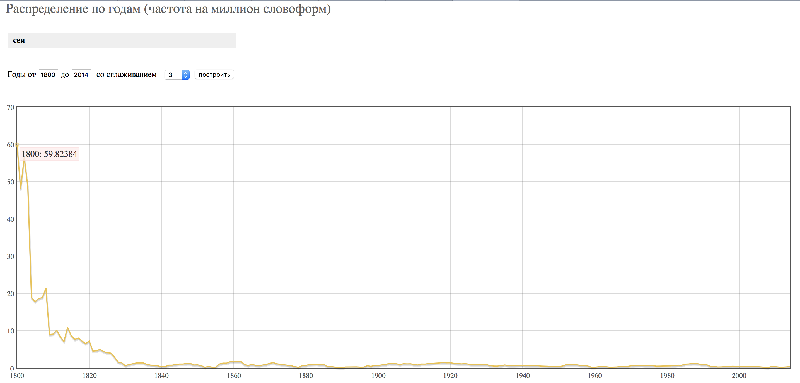

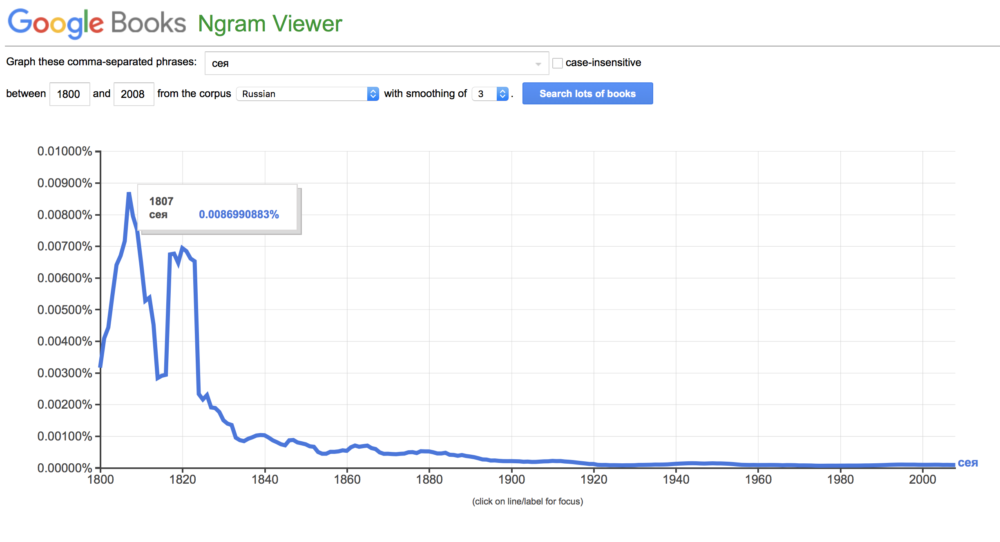

В целом НКРЯ и Google Ngrams отражают употребления слова "сея"; однако в Google Ngrams показан неожиданный скачок популярности этого слова в 1820х, в то время как по графику НКРЯ видно относительно равномерное прекращение употребления этого слова.

ЭТА
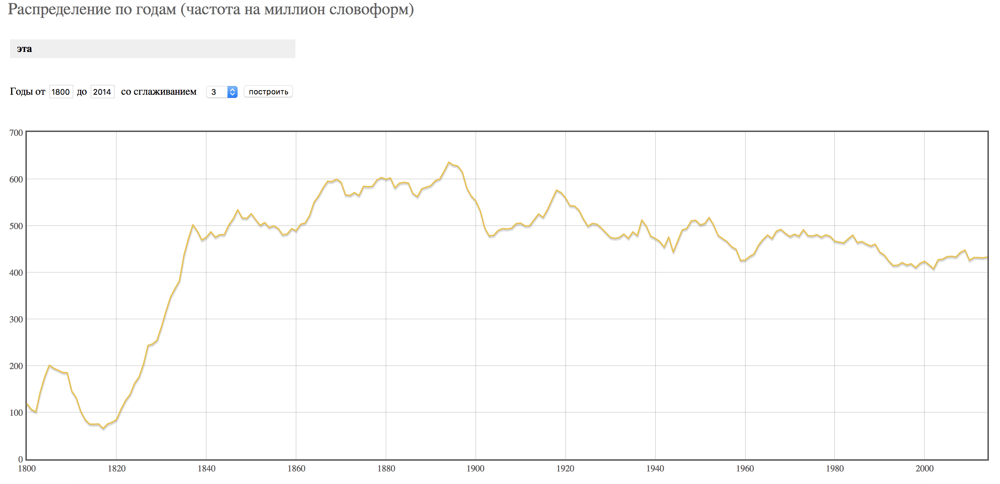

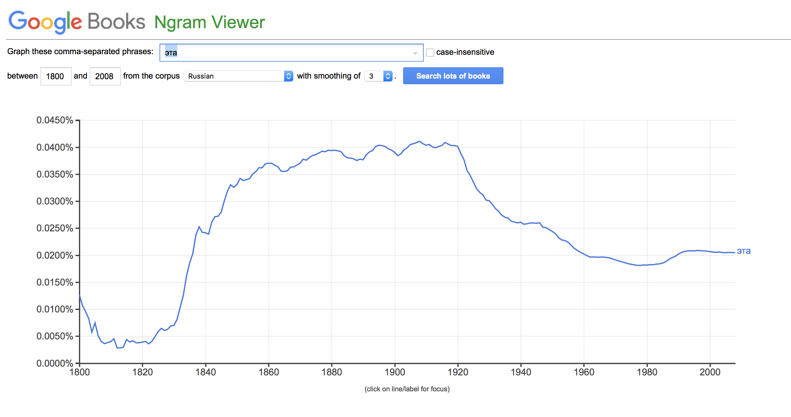

Графики НКРЯ и Google Ngrams одинаково показывают скачок популярности слова "эта" в конце 1830х годов. Однако показания графиков расходятся в отражении ситуации употребления слова "эта" в 20 и 21 веках. Согласно графику НКРЯ, в 1890х годах данное слово стало употребляться реже - с постоянными, тем не мененее, "скачками" популярности. График Google Ngrams отражает равномерный спад употребления этого слова после 1920х годов.

ИНАКО
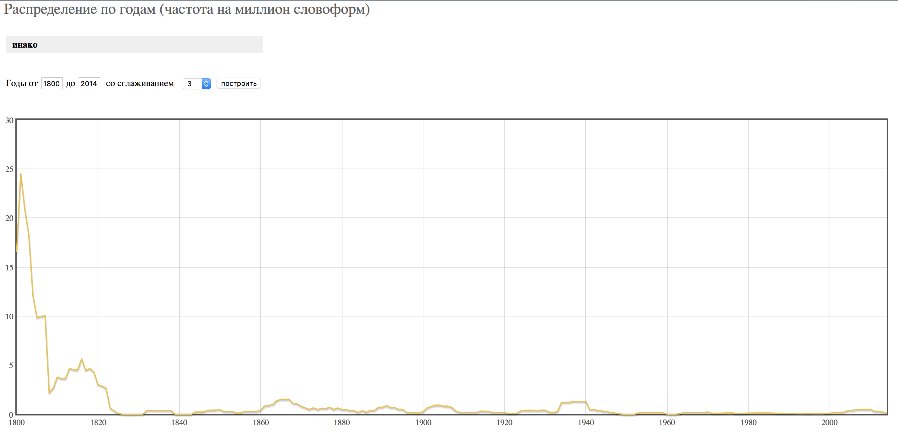

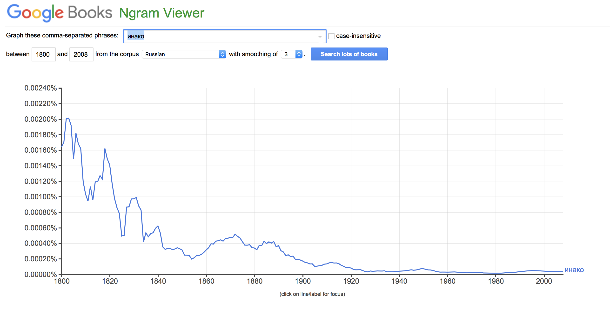

Графики НКРЯ и Google Ngrams отражают спад использования слова "инако", начиная с первого десятилетия 19го века. В графике Google Ngrams гораздо больше "скачков" популярности этого слова.

ИНАЧЕ
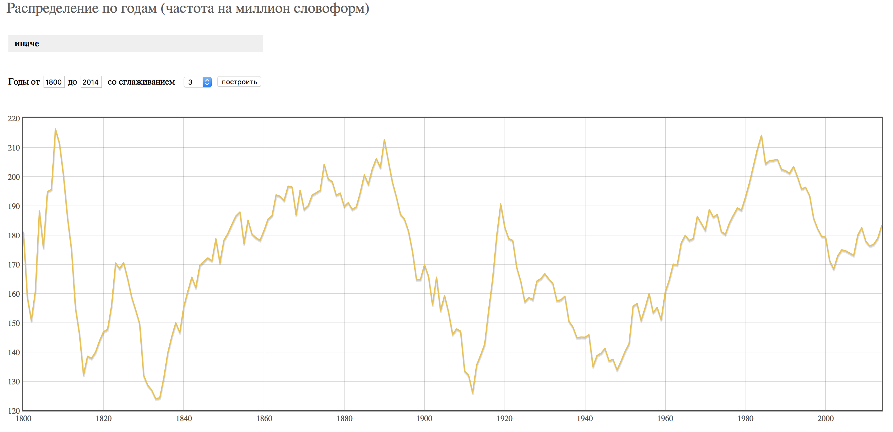

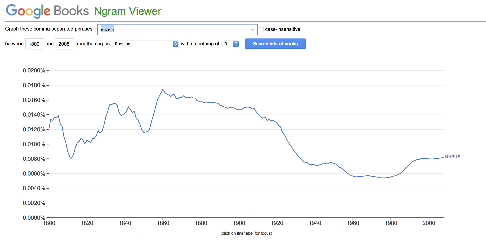

Графики НКРЯ и Google Ngrams сильно различаются при отражении употребления слова "иначе", поэтому выделить некую тенденцию довольно сложно. График НКРЯ показывает "скачки" популярности слова в 1810х, 1890х и 1990х годах и "падения" популярности - в 1830х и 1810х. Согласно Google Ngrams, "иначе" стало постепенно использоваться меньше начиная с 1860х годов.

ОТТОЛЬ
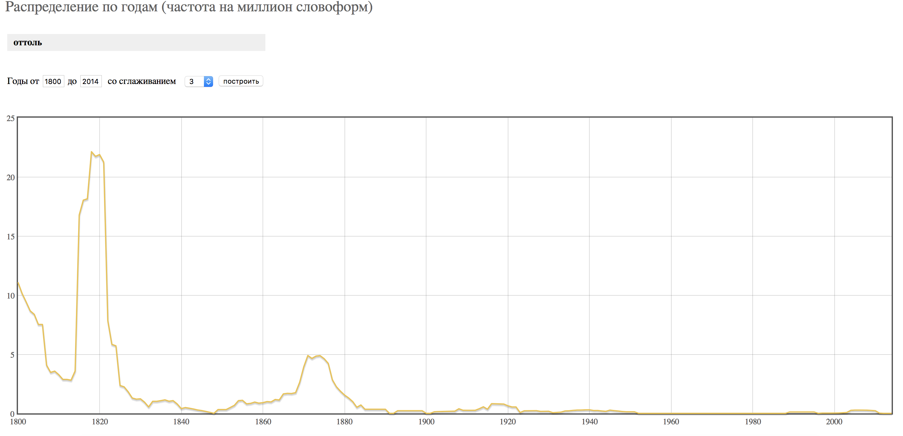

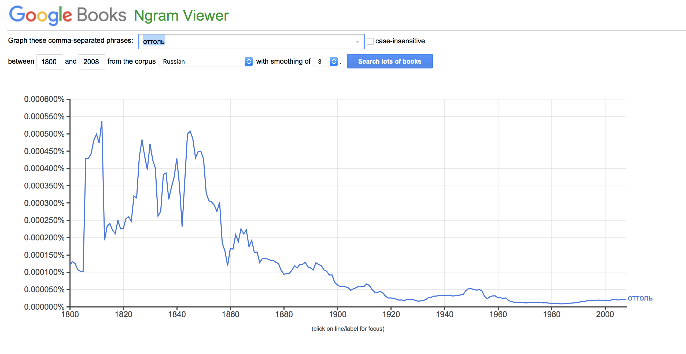

В данном случае показания графиков НКРЯ и Google Ngrams тоже различны. НКРЯ показывает "пик" популярности слова "оттоль" в 1820м году, а затем резкий спад (с внезапным небольшим "скачком" словоупотребления в 1870х). Google Ngrams отражает "скачки" популярности слова "оттоль" в 1810х, 1830х, 1850х годах и затем постепенный спад.

ОТТУДА
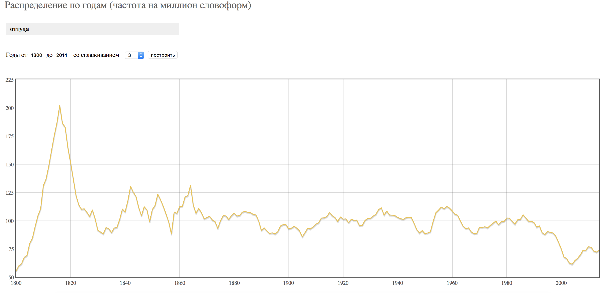

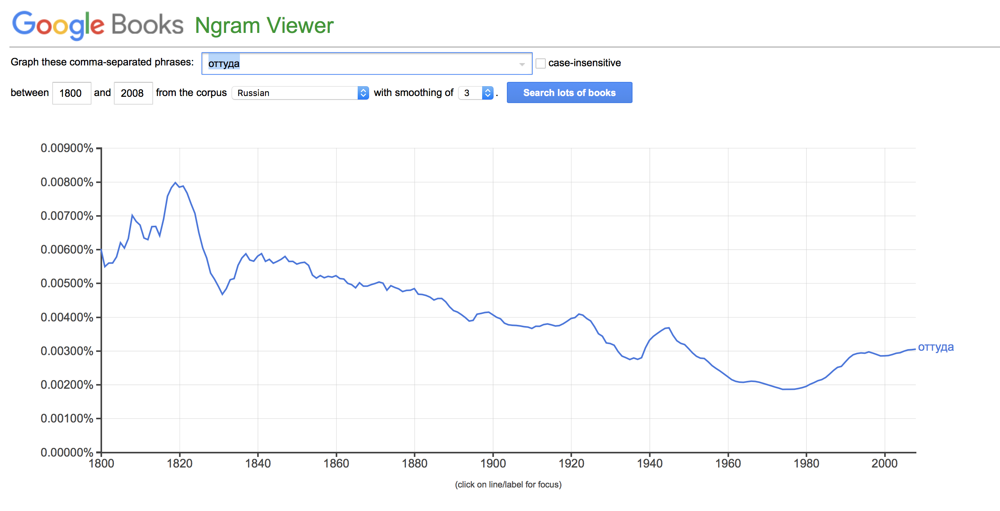

Оба графика показывают "пик" употребления слова "оттуда" примерно в 1820х годах, спад в 1830х годах и подъем в в 1840х. Однако затем график Google Ngrams отражает постепенное сокращение словоупотребления, а график НКРЯ - постоянные небольшие колебания в течение 20го века и внезапный спад использования слова "оттуда" в начале 21го.

3)

ipm "сея": (966 / 283 431 966) * 1 000 000 = 3,4

ipm "эта": (131 065 / 283 431 966) * 1 000 000 = 462,4

ipm "инако": (450 / 283 431 966) * 1 000 000 = 1,6

ipm "иначе": (48 353 / 283 431 966) * 1 000 000 = 170,6

ipm "оттоль": (185 / 283 431 966) * 1 000 000 = 0,6

ipm "оттуда": (25 433 / 283 431 966) * 1 000 000 = 89,7

3 задание

Использование НКРЯ помогает при написании моей курсовой работы. Я составляю комментарий к рассказу Олеши "Лиомпа"; для поиска схожих мотивов в других произведениях Олеши, а также в произведениях других писателей, я смотрю, в каком контексте употреблялись определенные слова (крыса, Ньютон, аэроплан и др.). Кроме того, НКРЯ отражает некоторые особенности советского быта: например, когда в СССР стали использовать примус, или как "лузганье семечек" перенеслось из деревни в город и что об этом думали представители интеллигенции.

Для понимания данного мне заданием текста - "Елисей, или раздраженный вакх" В.И. Майкова, - исследование корпуса не помогло никак, ведь я не читала всю поэму.
